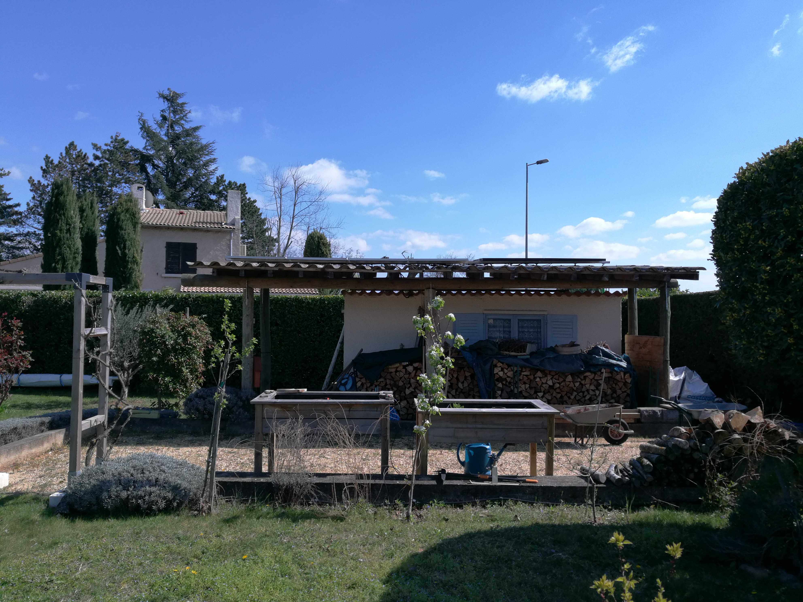
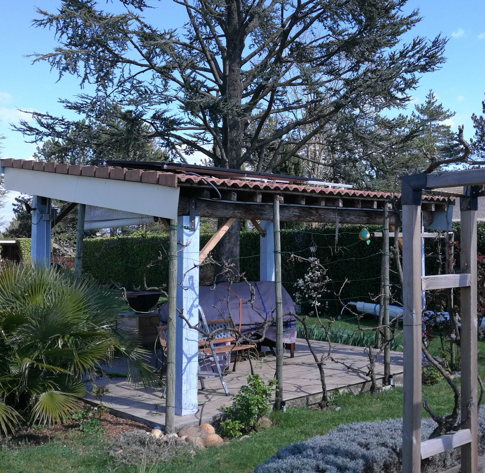
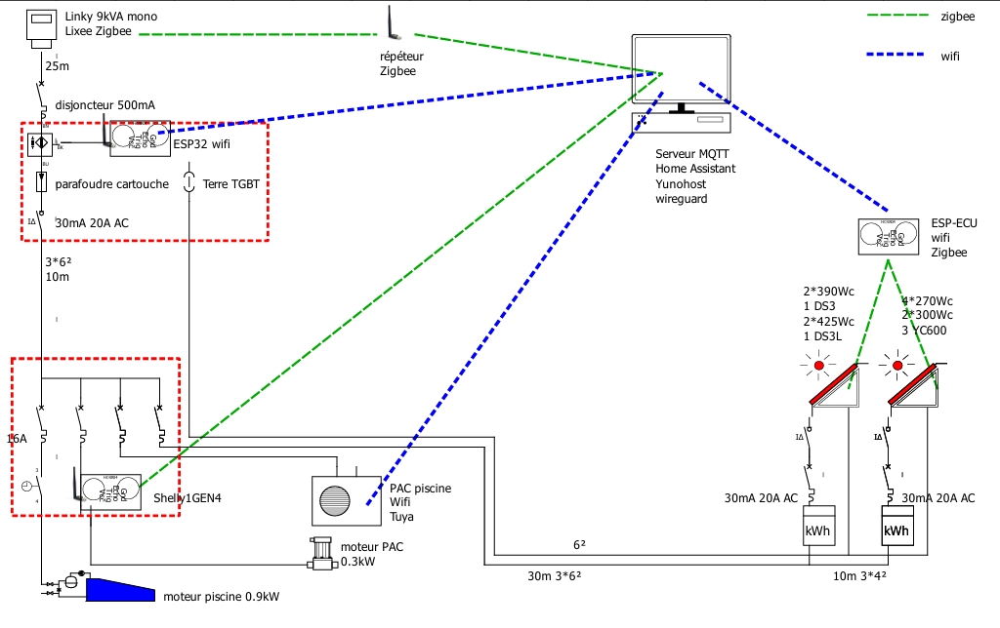
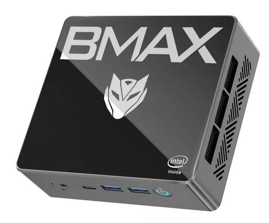
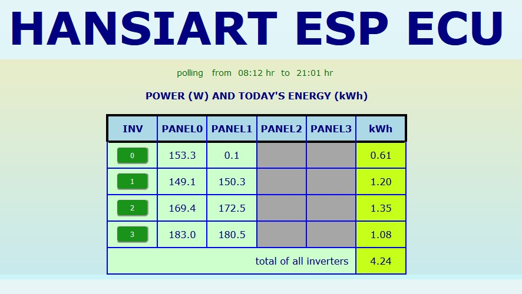
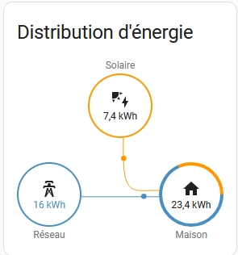
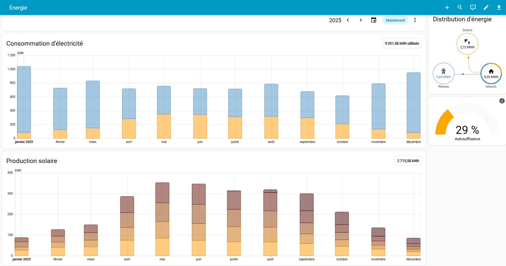
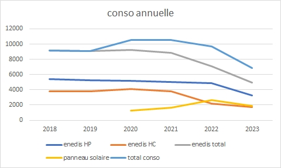

# Location

    Installation in the Valence area (Drôme, France), on a site exposed to wind (the mistral).
    90 m² house, renovated with new insulation.
    All-electric: domestic hot water (DHW); air-to-air heat pump; latest-generation wood insert (wood dried for 3 years in the garden).
    Prior works declaration (town hall), Enedis CACSI (self-consumption agreement), insurance: all OK. Consuel certificate OK.

# Solar panels

    I installed the panels myself on flat roofs (wood shed and pergola),
    with friends helping to lift the panels into place.
    Mounted on K2 rails.

Wood shed: north-west orientation, a few degrees of slope

Pergola: south-west orientation, 8° slope

    Panels are installed flat because the area is very exposed to wind. No brackets added to tilt them to, say, 30°.
    No installation on the roof of the house: the roof was redone recently (so still under the ten-year warranty) and is shaded by tall trees.

        1 Oscaro kit, end of 2019: 4 × 275 Wp panels + 2 YC600 microinverters (1 panel failed ==> replaced with a 365 Wp one)
        2 more 300 Wp panels added in 2021 + 1 YC600 (Oscaro) => no more room on the shed roof.
        2 more 390 Wp panels added in 2022 on the pergola + 1 DS3 (Oscaro), partially shaded in the morning.
        2 more 425 Wp panels added in 2025 on the pergola + 1 DS3L (Allo Solar), partially shaded in the morning.
            Total: 3,420 Wp

    Production runs on a dedicated line: residual-current device + circuit breaker.
    Surge arrester on the main panel.

# Electric wiring and radio mesh

Monitoring with a [BMAX B4 PLUS NUC](https://fr.bmaxit.com/MaxMini-B4-Plus-pd731782388.html)

[Proxmox](https://www.proxmox.com/en/) software instead of Win11, installed with the [domo-blog guide](https://www.domo-blog.fr/comment-installer-proxmox-guide-complet-pour-virtualiser-domotique/) (in French)

Home automation via [Home Assistant](https://www.home-assistant.io/)

Remote access through an [OVH domain name](https://www.ovhcloud.com/fr/domains/)

Domain name management via [Yunohost](https://yunohost.org/)

Encryption of remote access via [WireGuard](https://www.wireguard.com/)

Installed with the [TTeck](https://tteck.github.io/Proxmox/) scripts

# ESP-ECU

Microinverters are monitored with an ESP32-based ECU (ESP-ECU).

[GitHub repository](https://github.com/patience4711/read-APSystems-YC600-QS1-DS3)

[GitHub wiki](https://github.com/patience4711/read-APSystems-YC600-QS1-DS3/wiki)

[YouTube](https://www.youtube.com/watch?v=7ZOAcrYXxbM)

ESP-ECU data is pulled into Home Assistant through an MQTT broker (Mosquitto).

# Router (surplus diverter)

    1 custom-designed router, based on the PTWATT one

[Router on GitHub](https://jjdegaine.github.io/Wifi-Solar-panel-optimizer-/)

    In winter, surplus goes to an electric radiator.
    In summer, it drives the pool heat pump according to temperature.

    Self-consumption rate: 96%
    July 2025: 12,400 kWh produced since the start, and 467 kWh injected into the grid (Linky meter)

# Diverting surplus to the pool heat pump

See my [heat pump project](https://jjdegaine.github.io/PAC/)

# Energy contract

2018: PLUM contract via a Familles de France group purchase

2023: Octopus contract via a UFC-Que Choisir group purchase

2025: Octopus contract via a UFC-Que Choisir group purchase. Peak: €0.1717/kWh, off-peak: €0.1365/kWh

Peak/off-peak tariff (break-even limit)

# Production

    2020: 1,290 kWh => €230
    2021: 1,670 kWh => €300
    2022: 2,650 kWh (2 panels installed mid-May 2022) ==> €480
    2023: 2,485 kWh ==> €570. 1 panel failed and 10 days of downtime after the residual-current device tripped while I was away
                                                                            (big storm and lightning strike at the neighbour's)
    2024: 2,595 kWh ==> €593. 1 production stop while I was away (grid-side issue on the PV circuit) and Saharan dust
                                                                                    (cleaned on return from holiday)
    2025 (end of November): 2,600 kWh => €600

    Production is monitored with a toroid-based energy meter:

[Ketotek D52 2047](https://fr.aliexpress.com/i/32916282718.html)

Annual production and consumption:

# Consumption

    In winter (November to March): DHW, washing machine and dishwasher at night (off-peak hours)
    Outside winter: pool 0.9 kW. DHW between 1 pm and 4 pm (pool stopped between 1 pm and 2 pm), dishwasher and washing machine during the day.
    DHW uses a new electronic controller (still under warranty, so no diverting)

    ~10,000 kWh before the installation
    ~7,000 kWh after the PV installation

# Payback

    Installation cost: €2,700
    2019-2022: €1,010, then €600/year at the 1 February 2023 tariff
    (2700-1010)/600 => 3 years
    ROI: 6 years

# Power outages

    Handling power outages (1 to 12 hours, from time to time): heating by fireplace, battery pack for phones,
    camping stove for meals, e-reader for evenings by the fireplace.
    Outages are anticipated during snow/wind episodes.

# Future project

    There is no room left on the wood shed roof or the pergola!

# Mistakes / problems during the build

    Wiring done in 4 mm², so the earth had to be redone in 6 mm² afterwards (new trench!!!)

    When I commissioned the ESP-ECU, I saw production cuts on the DS3. These were caused by grid voltage that was too high (>251 V), even without PV production.
    Enedis fixed the problem. No issues since.
    See my post: https://www.facebook.com/groups/1099876516845266/posts/2469456369887267/?comment_id=2469470876552483&reply_comment_id=2469481526551418
