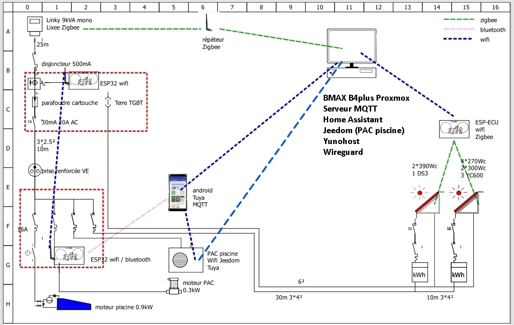
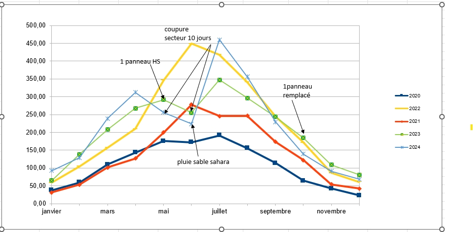

# localisation

    Installation dans la région Valentinoise (Drôme) dans un lieu exposé au vent (mistral)
    Maison 90m² rénovée avec isolation refaite.
    Tout électrique: ECS ;(PAC air air); insert dernière génération (bois séché 3 ans dans le jardin)
    DP mairie, CACSI enedis, assurance OK. Pas de consuel (non demandé par enedis)

# Panneau solaire

    installation des panneaux sur toit plat (abri pour le bois et pergola) par mes soins 
    avec l'aide des copains pour monter les panneaux.
    fixation avec rail K2

 abri bois orientaion nord ouest pente quelques degrés
 
pergola orientation sur douest pente 8°

    installation à plat car zone très exposée au vent. pas d'ajout d'équerre pour une inclinaison à 30° par exemple.
    Pas d'installation sur le toit de la maison car toit refait (donc sous décennale) et ombrage par des grands arbres.
    
        1 kit oscaro fin 2019 de 4 panneaux 275W + 2 YC600
        ajout 2 panneaux en 2021 300Wc + 1 YC600 (oscaro) => plus de place sur le toit de l'abri.
        ajout 2 panneaux en 2022 370Wc sur pergola + 1 DS3 (oscaro) partiellement ombragé le matin.

    production sur ligne dédiée: différentiel + disjoncteur via prise 230V Véhicule électrique renforcée.
    parafoudre sur tableau général.

# electric wiring and radio mesh

# ESP-ECU

suivi des micro_injecteurs par ECU-ESP32. (pour l'instant uniquement le DS3), il faut que je récupère les n° de série des YC600 pour les inclure dans esp-ECU (un jour sans vent...)

[dépôt github](https://github.com/patience4711/read-APSystems-YC600-QS1-DS3)

[wiki github](https://github.com/patience4711/read-APSystems-YC600-QS1-DS3/wiki)

[youtube](https://www.youtube.com/watch?v=7ZOAcrYXxbM)

Les données de l'ESP-ECU sont récupérées dans Jeedom via un broker MQTT (Mosquitto)

# routeur

    1 routeur conception perso sur la base de celui de PTWATT 

[github routeur](https://jjdegaine.github.io/Wifi-Solar-panel-optimizer-/)

    en hiver surplus vers radiateur électrique
    en été asservissement en température de la PAC piscine

# routage sur la pompe a chaleur piscine

voir mon projet [PAC](https://jjdegaine.github.io/PAC/)

# contrat énergie (contrat PLUM via appel d'offre famille de France)

tarif HP/ HC (limite rentable), tempo à l'étude (semble rentable)

# production

    2020: 1290kWh => 230€ 
    2021: 1670kWh => 300€
    2022: 2650kWh (installation 2 derniers panneaux mi mai 2022) ==> 480€ 
    objectif 2023 : 2800kWh ==> 600€ (tarif edf 01/02/2023)

    suivi de production par compteur énergie avec tore: ketotek D52 2047

# consommation

    en hiver (novembre à mars) : ECS, LL, LV la nuit (HC)
    hors hiver piscine 0.9kW. ECS entre 13h et 16h (arrêt piscine entre 13h et 14h), LV, LL en journée.
    ECS avec régulation électrique neuf (sous garantie donc pas de routage)

    ~ 10000kWh avant installation
    ~ 7500kWh après installation PV
    objectif 2023 7000kWh

# amortissement

    prix de l'installation: 2700€
    2019-2022: 1010€ puis 600€/an au tarif 1° février 2023 
    (2700-1010)/600 => 3 ans
    ROI 6 ans

# coupure secteur

    gestion des coupures secteur (1h à 12h de temps en temps). chauffage par cheminée, pack batterie pour les portables, 
    camping gaz pour les repas, ebook pour la soirée devant la cheminée. 
    Anticipation des coupures lors des épisodes neige /vent.

# projet futur

    Il ne reste plus de place sur le toit de l'abri bois ou de la pergola!
    par principe pas de batterie (amortissement, entretien).
    étude de rentabilité à faire pour une installation de panneaux verticaux. 
    production horaire inversée par rapport aux panneaux à plat. contrainte: vent!!!!

# erreur / problème pendant la réalisation

    câblage en 4² donc reprise pour la terre en 6² après (nouvelle tranchée!!!)

    lors de la mise en route de l'ESP-ECU j'ai vu des coupures de production sur le DS3, 
    ces coupures étaient liées à une tension secteur trop élevée (>251V) même sans prodction PV.
    Enedis a réglé le problème. Depuis RAS
    voir mon post: https://www.facebook.com/groups/1099876516845266/posts/2469456369887267/?comment_id=2469470876552483&reply_comment_id=2469481526551418

